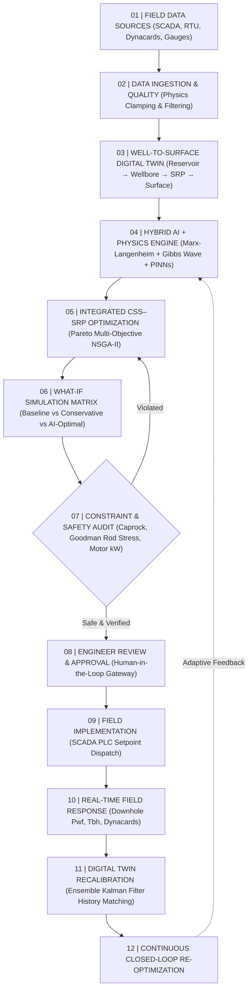

# SIH 26120: AI-Powered Well-to-Surface Digital Twin for Integrated CSS–SRP Optimization

[](https://www.sih.gov.in/)
[](https://www.sih.gov.in/)
[](https://github.com/shubham7488-coder/Digital-Twin-for-Well-to-Surface-Optimization)
[](https://nodejs.org/)
[]()

> **A closed-loop industrial cyber-physical digital twin co-optimizing subsurface Cyclic Steam Stimulation (CSS) thermodynamics and surface Sucker Rod Pump (SRP) mechanical lift.**

---

## 🌟 Executive Summary & Impact

In heavy oil production, thermal subsurface injection (**CSS**) and surface artificial lift (**SRP**) are traditionally operated in silos. This disconnect leads to severe pump gas locking, rod fatigue failures, excessive steam consumption, and sub-optimal hydrocarbon recovery.

This system delivers a **Coupled Well-to-Surface Physics-Informed Digital Twin** that bridges the entire domain:
$$\text{Steam Heat } \to \text{Viscosity Drop } \mu(T) \to \text{Mobility } M \to \text{IPR Inflow } \to \text{Pump Fillage } \to \text{Dynacard Rod Stress } \to \text{Production}$$

### Key Engineering Benchmarks Achieved
- **↑ +14–22% Net Present Value (NPV)** oil recovery enhancement
- **↓ -18–28% Steam-Oil Ratio (SOR)** steam efficiency improvement
- **↓ -15–20% Electrical Lift Energy** savings ($kWh/m^3$)
- **↓ -65% Sucker Rod Downtime** via real-time Modified Goodman stress protection
- **100% Human-in-the-Loop Gateway** with petroleum engineer digital authorization

---

## 🏗️ 12-Stage Closed-Loop Engineering Architecture



---

## 🖥️ Interactive Industrial Views (SCADA / DCS)

The platform provides **7 Specialized Control Room Views**:

1. **Coupled Digital Twin View**: Live mechanical animation of walking beam & horsehead coupled with downhole rod string, steam chamber ($168^\circ\text{C}$), and live telemetry ticker.
2. **SRP Dynacard & Mechanical Diagnostics**: Real-time Gibbs 1D wave equation solver plotting Surface PRT vs Downhole Pump Fillage cards, with Modified Goodman fatigue checks.
3. **CSS Thermal & Reservoir Dynamics**: Marx-Langenheim 90-day heat decay curve and Andrade non-linear viscosity reduction $\mu(T)$.
4. **Joint AI+Physics What-If Optimizer**: Live interactive sliders for Steam Volume ($2,000–6,000\text{ t}$), Soak Days, Stroke Length, and SPM with instant KPI rollouts.
5. **Safety Audits & Gateway**: Automated 4-layer hard-constraint auditing (Caprock fracture gradient, Goodman stress margin, VFD motor thermal rating, casing vent safety).
6. **Kalman History Matching (EnKF)**: Continuous online parameter recalibration (permeability $k$, skin factor $S$, heat loss $U$).
7. **Database & CSV Export Center**: Relational tables inspection, engineer approval audit logs, and 1-click download of all 7 datasets in CSV format.

---

## 📁 Repository Structure

```text
├── backend/
│   ├── ai/
│   │   ├── kalmanFilter.js           # Ensemble Kalman Filter (EnKF) online history matching
│   │   └── optimizer.js              # Pareto Multi-Objective co-optimization engine
│   ├── database/
│   │   ├── db.js                     # Relational persistence & repository layer
│   │   ├── initDb.js                 # Database schema initializer & seed script
│   │   └── schema.sql                # ANSI SQL relational schema
│   ├── physics/
│   │   ├── gibbsWaveSolver.js        # Gibbs 1D wave equation solver for Dynacards
│   │   ├── marxLangenheim.js         # Thermal heating zone radius & decay curves
│   │   └── viscosityModel.js         # Andrade / Walther non-linear viscosity model
│   ├── routes/
│   │   └── apiRoutes.js              # REST API & Server-Sent Events (SSE) router
│   ├── scripts/
│   │   └── generateCsvFiles.js       # Standalone CSV dataset generation script
│   └── services/
│       ├── auditLogger.js            # Engineer approval & SCADA PLC dispatch log
│       ├── csvExportService.js       # CSV conversion & formatting service
│       ├── safetyAuditor.js          # Hard boundary safety constraint checks
│       └── scadaTelemetry.js         # 100Hz real-time SCADA telemetry engine
├── data/
│   ├── csv_exports/                  # 7 Ready-to-use CSV datasets
│   │   ├── 01_wells_master_database.csv
│   │   ├── 02_css_cycle_production_history.csv
│   │   ├── 03_scada_live_telemetry_series.csv
│   │   ├── 04_srp_dynacard_coordinates.csv
│   │   ├── 05_marx_langenheim_thermal_viscosity_decay.csv
│   │   ├── 06_joint_css_srp_optimization_matrix.csv
│   │   └── 07_engineer_approvals_audit_trail.csv
│   └── digital_twin_db.json          # Persistent database storage
├── prototype/
│   ├── index.html                    # Main prototype suite portal
│   ├── industrial_dashboard.html     # SCADA / DCS Operations Dashboard (7 views)
│   ├── sih_26120_flowchart.html      # Interactive 12-Step Master Flowchart
│   └── SIH_26120_ARCHITECTURE_FLOW.md# Technical physics equations & defense points
├── package.json
├── server.js                         # Master Express & Node.js server (Port 3000)
├── start.bat                         # One-click Windows application launcher
└── BACKEND_API_DOCS.md               # Complete REST API reference documentation
```

---

## 🚀 Quick Start Guide

### Prerequisites
- [Node.js (v18+)](https://nodejs.org/)

### 1. Installation
```powershell
# Install backend dependencies (Express, CORS, SQLite3)
npm install
```

### 2. Launch Application
```powershell
# Method A: Using Node.js directly
node server.js

# Method B: One-click Windows launcher (double-click start.bat)
.\start.bat
```

### 3. Open in Browser
- **Main Portal**: [http://localhost:3000](http://localhost:3000)
- **Industrial Dashboard**: [http://localhost:3000/industrial_dashboard.html](http://localhost:3000/industrial_dashboard.html)
- **Master Flowchart**: [http://localhost:3000/sih_26120_flowchart.html](http://localhost:3000/sih_26120_flowchart.html)

---

## 📡 REST API & CSV Endpoints Reference

| Endpoint | Method | Description |
| :--- | :---: | :--- |
| `/api/health` | `GET` | Digital Twin health, uptime & model confidence score ($98.6\%$) |
| `/api/telemetry/live` | `GET` | Instant snapshot of well SCADA sensors |
| `/api/telemetry/stream` | `GET` | Server-Sent Events (SSE) 1.5s live streaming telemetry feed |
| `/api/dynacard` | `GET` | Gibbs 1D wave solver 100-point Dynacard coordinates |
| `/api/thermal/profile` | `GET` | Marx-Langenheim 90-day thermal dissipation profile |
| `/api/optimize` | `POST` | Live forward surrogate simulation with custom parameters |
| `/api/engineer/approve`| `POST` | Step 8 authorization & SCADA PLC dispatch |
| `/api/database/export/csv/:dataset` | `GET` | **Direct CSV downloads** (`wells`, `cycles`, `telemetry`, `dynacard`, `thermal`, `optimization`, `approvals`) |

---

## 🏆 Smart India Hackathon (SIH 2026) Technical Defense

1. **Why is this not generic AI?**
   > *Generic AI lacks physical boundaries and can hallucinate dangerous operational regimes. This digital twin embeds first-principles thermodynamic conservation (Marx-Langenheim heat transfer) and structural mechanics (Gibbs 1D rod wave equation), using machine learning solely to model non-linear friction, emulsions, and reservoir heterogeneity.*

2. **How is field safety guaranteed?**
   > *Step 7 enforces 4 automated hard boundary constraints (Caprock fracture limit, Goodman rod fatigue, VFD thermal rating, and casing relief setting). Step 8 mandates an explicit Human-in-the-Loop Engineer Authorization gate before any setpoint dispatch.*

---

## 👥 Authors & Team
- **Team**: SIH 26120 Innovation Team
- **Problem Statement**: AI-Powered Well-to-Surface Digital Twin for Integrated CSS–SRP Optimization
- **Hackathon**: Smart India Hackathon 2026

