# SIH 26120: Master Engineering Flow & Digital Twin Architecture
## AI-Powered Well-to-Surface Digital Twin for Integrated CSS–SRP Optimization

---

## 1. Master Flowchart (Mermaid.js)

```mermaid
graph TD
    %% Styling Classes
    classDef dataNode fill:#0c1c38,stroke:#00b4d8,stroke-width:2px,color:#ffffff;
    classDef twinNode fill:#0f244a,stroke:#2dd4bf,stroke-width:2px,color:#ffffff;
    classDef aiNode fill:#131c38,stroke:#60a5fa,stroke-width:2px,color:#ffffff;
    classDef optNode fill:#171c3b,stroke:#a78bfa,stroke-width:2px,color:#ffffff;
    classDef simNode fill:#241d13,stroke:#fbbf24,stroke-width:2px,color:#ffffff;
    classDef safetyNode fill:#2d1a15,stroke:#f87171,stroke-width:2px,color:#ffffff;
    classDef approveNode fill:#0c2e22,stroke:#34d399,stroke-width:3px,color:#ffffff;
    classDef actionNode fill:#0b2138,stroke:#38bdf8,stroke-width:2px,color:#ffffff;
    classDef loopNode fill:#0d2a4a,stroke:#00f0ff,stroke-width:3px,color:#ffffff;

    %% 01 FIELD DATA SOURCES
    S01["<b>01 | FIELD DATA SOURCES</b><br/>SCADA &bull; IoT Sensors &bull; Production History &bull; Well Tests &bull; CSS Records &bull; SRP/VFD Dynacards"]:::dataNode
    
    %% 02 DATA QUALITY
    S02["<b>02 | DATA INGESTION & QUALITY PIPELINE</b><br/>Stream Ingestion &rarr; Range Checks &rarr; Cleaning &rarr; Normalization"]:::dataNode
    D02{"Data Valid?"}:::safetyNode
    S02Clean["Data Quality / Missing Imputation<br/>(Kalman filter / physics interpolation)"]:::dataNode
    
    %% 03 DIGITAL TWIN
    S03["<b>03 | WELL-TO-SURFACE DIGITAL TWIN (4-Layer)</b><br/>Reservoir &rarr; Wellbore &rarr; SRP System &rarr; Surface Facilities<br/><i>Steam &rarr; Temp Distribution &rarr; Viscosity &rarr; Mobility &rarr; SRP Rod Load &rarr; Production</i>"]:::twinNode
    
    %% 04 AI + PHYSICS ENGINE
    subgraph S04_Group ["04 | HYBRID AI + PHYSICS ENGINE"]
        S04AI["<b>AI/ML Prediction</b><br/>• Temperature decay (LSTM)<br/>• Viscosity reduction<br/>• Production rate (XGBoost)<br/>• SRP Load & Rod fatigue (GNN)<br/>• Anomaly risk detection"]:::aiNode
        S04Phy["<b>Physics-Based Models</b><br/>• Reservoir thermal flow (Marx-Langenheim)<br/>• Heat transfer & steam chamber<br/>• Multiphase hydraulics (Beggs-Brill)<br/>• SRP wave equation (Gibbs 1D)"]:::aiNode
    end
    S04Merged["<b>Validated Well State Prediction</b><br/>Fused Thermodynamic & Mechanical State"]:::aiNode
    
    %% 05 INTEGRATED CSS-SRP OPTIMIZATION
    subgraph S05_Group ["05 | INTEGRATED CSS–SRP CO-OPTIMIZATION"]
        S05CSS["<b>CSS Optimization</b><br/>• Steam Volume (m³)<br/>• Injection Pressure (MPa)<br/>• Soak Duration (Days)<br/>• Economic Cut-off Rate"]:::optNode
        S05SRP["<b>SRP Optimization</b><br/>• Stroke Length (in)<br/>• Pumping Speed (SPM)<br/>• VFD Frequency Schedule<br/>• Peak Polished Rod Load (PPRL)"]:::optNode
    end
    S05Joint["<b>Joint Pareto CSS–SRP Optimization</b><br/>Max NPV Oil Recovery | Min Steam-Oil Ratio (SOR) | Min Energy (kWh/bbl)"]:::optNode
    
    %% 06 WHAT-IF SIMULATION
    S06["<b>06 | WHAT-IF SIMULATION & TRADE-OFF MATRIX</b><br/>Baseline Historical vs Conservative vs AI-Optimized vs Custom Strategy<br/><i>Benchmarking: Net Oil Gain &bull; SOR Reduction &bull; Energy Consumption &bull; Rod Fatigue Risk</i>"]:::simNode
    
    %% 07 SAFETY CHECK
    D07{"<b>07 | Feasible & Safe?</b><br/>• Reservoir Fracture Gradient<br/>• API Goodman Rod Fatigue<br/>• VFD Motor Thermal Envelope<br/>• Environmental Vent Limits"}:::safetyNode
    
    %% 08 ENGINEER REVIEW
    S08["<b>08 | PRODUCTION ENGINEER REVIEW & DECISION SUPPORT</b><br/>Predictions + Confidence Score + Physics Audit Log + SHAP Explainability<br/><b>[ ⭐ ENGINEER APPROVE ACTION ]</b><br/><i>(100% Human-in-the-Loop Gateway — Zero Unsupervised Field Overrides)</i>"]:::approveNode
    
    %% 09 FIELD IMPLEMENTATION
    S09["<b>09 | FIELD IMPLEMENTATION</b><br/>Approved Steam Injection Target + Approved SRP VFD Profile &rarr; SCADA PLC Dispatch"]:::actionNode
    
    %% 10 FIELD RESPONSE
    S10["<b>10 | REAL-TIME FIELD RESPONSE OBSERVATION</b><br/>Transient P_wf &bull; Downhole Temp T_bh &bull; Gross Fluid Rate Q_liq &bull; Dynamometer Cards"]:::dataNode
    
    %% 11 DIGITAL TWIN UPDATE
    S11["<b>11 | DIGITAL TWIN & MODEL RE-CALIBRATION</b><br/>Dynamic History Matching (EnKF) &bull; Model Drift Correction &bull; Residual Learning"]:::twinNode
    
    %% 12 CLOSED LOOP
    S12["<b>12 | CONTINUOUS CLOSED-LOOP RE-OPTIMIZATION</b><br/>Adaptive Dynamic Control Policy for Subsequent CSS Cycles & SRP Operations"]:::loopNode

    %% Final Target
    TARGET(["<b>TARGET ACHIEVED:</b> ↑ Oil Recovery (+14-22%) | ↓ SOR (-18-28%) | ↓ Energy (-15-20%) | ↓ Rod Failure (-65%)"]):::approveNode

    %% Flow Connections
    S01 --> S02
    S02 --> D02
    D02 -- "No (Corrupt / Missing)" --> S02Clean
    S02Clean --> S02
    D02 -- "Yes (Clean & Validated)" --> S03
    
    S03 --> S04AI
    S03 --> S04Phy
    S04AI --> S04Merged
    S04Phy --> S04Merged
    
    S04Merged --> S05CSS
    S04Merged --> S05SRP
    S05CSS <--> S05SRP
    S05CSS --> S05Joint
    S05SRP --> S05Joint
    
    S05Joint --> S06
    S06 --> D07
    D07 -- "No (Constraint Violated)" --> S05Joint
    D07 -- "Yes (Safe & Certified)" --> S08
    
    S08 --> S09
    S09 --> S10
    S10 --> S11
    S11 --> S12
    
    %% Closed Loop Feedback
    S12 -. "CLOSED-LOOP FEEDBACK: New Field Telemetry → Twin Calibration → Re-Optimization" .-> S04AI
    S12 -.-> S04Phy
    S12 ==> TARGET
```

---

## 2. Detailed 12-Step Engineering Specifications

| Step | Stage Name | Engineering Scope & Subsystems | Physics & ML Algorithms | Output Deliverable |
| :--- | :--- | :--- | :--- | :--- |
| **01** | **Field Data Sources** | Downhole gauges, Steam injection meters, SCADA RTU, Dynacards, VFD drives | Modbus/OPC-UA edge buffering, packet alignment | Raw multi-rate telemetry streams |
| **02** | **Data Ingestion & Quality** | Real-time stream processing, range clamping, missing value handling | Modified Z-score outlier filtering, thermodynamic bounds | Clean synchronized engineering tensors |
| **03** | **Well-to-Surface Digital Twin** | 4 coupled domains: Reservoir $\to$ Wellbore $\to$ SRP $\to$ Surface facilities | Steam enthalpy $\to$ temp field $\to$ Andrade viscosity $\mu(T) \to$ IPR $\to$ Dynacard $\to$ lift | Multi-domain spatial-temporal twin state |
| **04** | **AI + Physics Engine** | Parallel hybrid architecture: Physics foundation + ML residual compensation | Marx-Langenheim heat model, Gibbs 1D wave equation + PINNs & LSTM | Thermodynamically validated predictions |
| **05** | **Integrated CSS–SRP Optimization** | Simultaneous tuning of thermal injection and mechanical lift | Multi-Objective NSGA-II / Bayesian Pareto front ($NPV$, $SOR$, $kWh/bbl$) | Optimal parameter candidate sets |
| **06** | **What-If Simulation** | Scenario comparative matrix (Baseline vs Conservative vs AI-Optimized) | Digital twin forward multi-period rollouts | Comparative KPI scorecards |
| **07** | **Constraint & Safety Audit** | Caprock fracture limit, Goodman rod fatigue envelope, VFD thermal limit | Hard penalty boundary validation | Certified safe parameter recipe |
| **08** | **Engineer Review & Approval** | Human-in-the-Loop decision support with explainable AI (XAI) | SHAP feature importance & model confidence intervals | Authorized digital signature (No auto-override) |
| **09** | **Field Implementation** | Automated setpoint dispatch to steam boiler & VFD inverter | SCADA PLC register writes & PID ramp profiles | Actuated field equipment settings |
| **10** | **Real-Time Field Response** | Downhole $P_{wf}, T_{bh}$, gross fluid rate, surface Dynacard deformation | Multi-phase sensor observation | Live response telemetry series |
| **11** | **Digital Twin Recalibration** | Dynamic history matching, reservoir parameter estimation | Ensemble Kalman Filter (EnKF) & Bayesian drift updates | Updated high-fidelity calibrated twin |
| **12** | **Closed-Loop Re-Optimization** | Next CSS cycle timing, soak duration trigger, adaptive SRP speed control | Continuous dynamic policy re-evaluation | True closed-loop operational excellence |

---

## 3. Core Physics & Mathematical Formulations

### A. Subsurface Viscosity Reduction (Andrade / Walther Equation)
$$\mu(T) = \mu_0 \cdot \exp\left[\frac{b}{T + c}\right]$$
*Where $\mu$ decreases by orders of magnitude from $>10,000\text{ cP}$ to $<50\text{ cP}$ under steam heat.*

### B. Cyclic Steam Heating Zone (Marx–Langenheim Model)
$$A(t) = \frac{Q_i \cdot M \cdot h_f}{4 k_h (T_s - T_R) \sqrt{t_D}} \cdot \left(e^{t_D} \operatorname{erfc}\sqrt{t_D} + 2\sqrt{\frac{t_D}{\pi}} - 1\right)$$

### C. Sucker Rod Wave Equation (Gibbs 1D Dynamic Model)
$$\frac{\partial^2 u}{\partial t^2} = a^2 \frac{\partial^2 u}{\partial x^2} - c \frac{\partial u}{\partial t}$$
*Where $u(x,t)$ is rod displacement, $a$ is acoustic wave speed in steel ($\approx 5000\text{ m/s}$), and $c$ is fluid viscous damping.*

### D. Multi-Objective Optimization Objective Function
$$\max_{\mathbf{u}_{\text{CSS}}, \mathbf{u}_{\text{SRP}}} J = \int_{0}^{t_{\text{cycle}}} \left[ P_{\text{oil}} \cdot q_o(t) - C_{\text{steam}} \cdot q_s(t) - C_{\text{elec}} \cdot P_{\text{motor}}(t) \right] dt$$
$$\text{Subject to: } P_{\text{inj}} < P_{\text{frac}}, \quad \sigma_{\text{rod}} < \sigma_{\text{Goodman}}, \quad T_{\text{motor}} < T_{\text{max}}$$

---

## 4. Key Talking Points for SIH 2026 Presentation & Jury Q&A

1. **Why is this NOT a generic AI project?**
   > *"Unlike generic black-box AI, our architecture embeds first-principles physics (Marx-Langenheim heat transfer, Beggs-Brill hydraulics, Gibbs 1D wave dynamics) alongside machine learning. The ML only learns the residual unmodeled effects, ensuring zero physical hallucinations."*

2. **How is safety guaranteed during field operation?**
   > *"Step 7 enforces automated hard constraints (fracture gradients and rod fatigue), and Step 8 mandates an explicit Human-in-the-Loop Engineer Approval gate. The AI acts purely as high-precision decision support with zero unsupervised field overrides."*

3. **What makes the CSS–SRP coupling innovative?**
   > *"Conventional oilfield workflows optimize steam injection (subsurface) and rod pumping (surface) in isolation. Our digital twin connects them: steam volume directly determines viscosity decay, which governs inflow IPR, which in turn determines pump fillage and rod string dynamic loading."*

4. **How does the system handle real-world sensor noise & drift?**
   > *"Step 2 performs physics-bounded data validation and Kalman imputation, while Step 11 utilizes Ensemble Kalman Filtering (EnKF) for continuous online parameter re-calibration as the reservoir depletes."*

